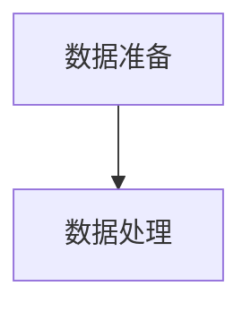
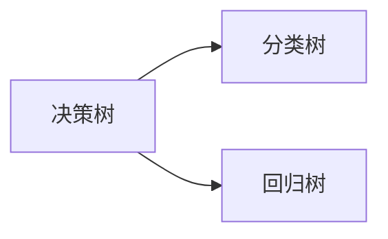
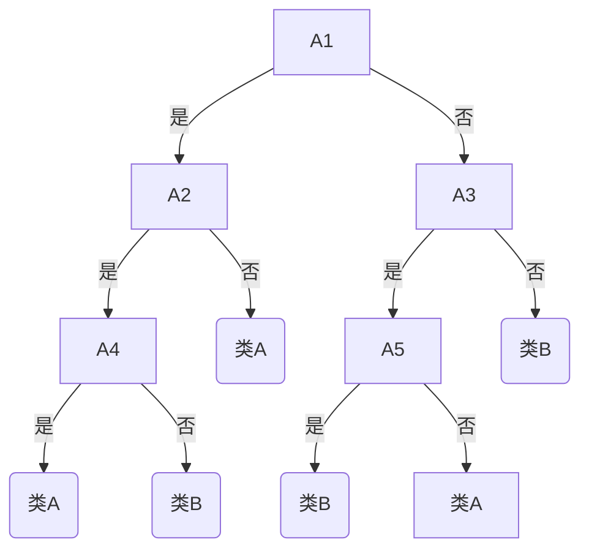
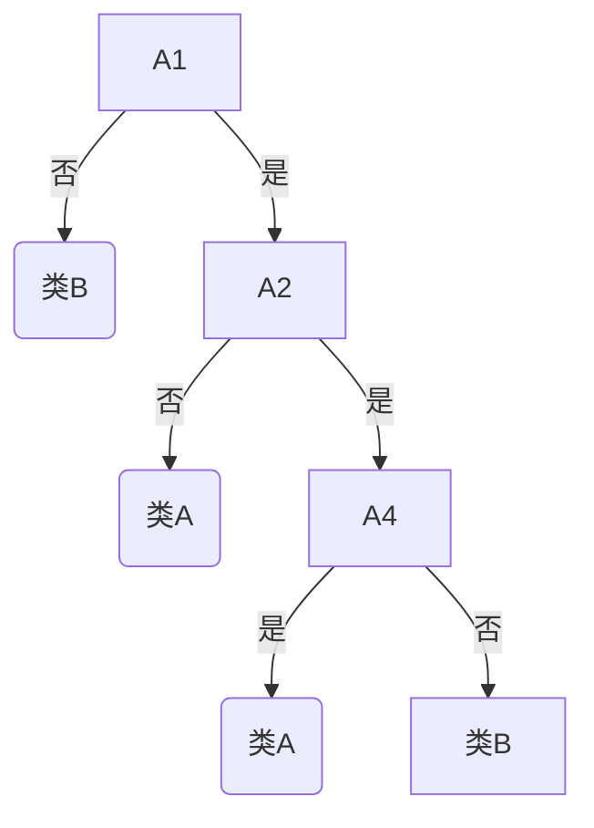
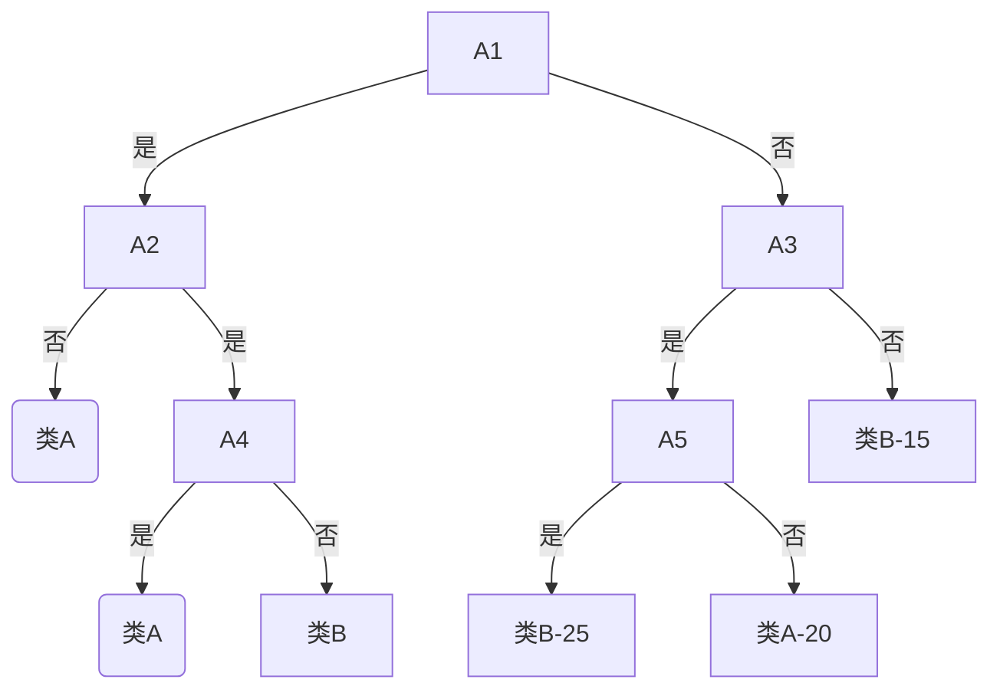

# 决策树讲解2-CART

1. 决策树类型
2. 数据准备
3. gini指标
4. CART的三个步骤


## 1.1 决策树类型



### 1.1.1 数值属性
1. 取出训练样本中属性A的所有不同取值,将这些值按照从小到大的顺序排序.
2. 计算排序后的数值序列中每相邻两个数值的中间值，得到一个新的序列A’.
3. 根据A’生成属性A的标准问题集. A =（1，1.5，1.7，1.9，2 ) A’= (1.25，1.6，1.8，1.95 ) 属性A的标准问题集为 { Is A≤1.25，Is A≤1.6，Is A≤1.8，Is A≤1.95}

### 1.1.2 分类属性
1. 取出训练样本中属性A中所有不同取值构成集合S(A).
2. 计算一个由S(A)的子集构成的集合subsets(A). subsets(A)的元素满足以下两个条件：
- 如果s∈subsets(A)，那么s≠S(A)，并且s不为空；
- 如果s1，s2∈subsets(A)，那么s1∪s2≠S(A)。
3. 根据subsets(A)生成属性A的标准问题集.

### 1.2 数据准备
用$f(i)$表示S(A)的前i个元素构成的所有可能集合，那么$f(i)$满足以下递推公式：
\[
f(i) = \{(i-1),[a_i \vee f(i)], \{ a_i\} \}
\]
去掉$f(|S(A)|)$中不满足条件（1）和（2）的元素，就可以得到subsets(A)

S(A)={a1，a2，a3，a4} subsets(A)={{a1}，{a1，a2}，{a2}，{a1，a3}，{a1，a2，a3}，{a2，a3}，{a3}}。 于是，属性A的标准问题集为{ Is A∈{a1}, Is A∈{a1，a2}, Is A∈{a2}, Is A∈{a1， a3}, Is A∈{a1，a2，a3}, Is A∈{a2，a3}, Is A∈{a3}}

### 1.3 基尼指标
> 基尼系数
- 其具体含义是指，在全部居民收入中，用于进行不平均分配的那部分收入所占的比例。基尼系数最大为“1”，最小等于“0”。前者表示居民之间的收入分配绝对不平均，即100%的收入被一个单位的人全部占有了；而后者则表示居民之间的收入分配绝对平均，即人与人之间收入完全平等，没有任何差异。但这两种情况只是在理论上的绝对化形式，在实际生活中一般不会出现。因此，基尼系数的实际数值只能介于0～1之间，基尼系数越小收入分配越平均，基尼系数越大收入分配越不平均。国际上通常把0.4作为贫富差距的警戒线，大于这一数值容易出现社会动荡。

给定数据集S的gini指标定义为 :
\[
gini(S) = 1 - \sum_{i=0}^m P_i^2
\]
(m为类别数，P<sub>i</sub>为S中属于第i类的概率).

- 在CART算法中,基尼不纯度表示一个随机选中的样本在子集中被分错的可能性。**基尼不纯度为这个样本被选中的概率乘以它被分错的概率**。当一个节点中所有样本都是一个类时，基尼不纯度为零。

\[
gini(S) = \sum_{i=1}^m P_i(1-P_i) = \sum_{i=1}^m (P_i - P_i^2)=\sum_{i=1}^m P_i - \sum_{i=1}^m P_i^2=1-\sum_{i=1}^m P_i^2
\]


C1 |C2 | - |C1 |C2 | - |C1|C2
---|---|---|---|---|---|---|---
0|6|-|1|5|-|3|3

- P(C1) = 0/6 = 0
- P(C2) = 6/6 = 1
- gini = 1 – P(C1)<sup>2</sup> – P(C2)<sup>2</sup> = 1 – 0 – 1 = 0
---
- P(C1) = 1/6
- P(C2) = 5/6
- gini = 1 – (1/6)<sup>2</sup> – (5/6)<sup>2</sup> = 0.278
---
- P(C1) = 3/6
- P(C2) = 3/6
- gini = 1 – (3/6)<sup>2</sup> – (3/6)<sup>2</sup> = 0.500

- 当类分布均衡时，Gini值达到最大值 (1 - 1/n<sub>c</sup>)
- 当只有一个类时，Gini值达到最小值0
- Gini值越小，类越纯

### 1.4 基于gini的划分
- 当根据属性A分割成 k 个部分 , 划分的质量可由下面公式计算
\[
gini(S,A)=\sum_{i=1}^k \frac{n_i}{n} gini(S_i)
\]
- 注：n<sub>i</sub> = 孩子节点i的数据个数,n = 父节点的数据个数.

-  二元划分
\[
gini(S,A)=\frac{|S_1|}{|S|} gini(S_1) + \frac{|S2|}{|S|} gini(S_2)
\]

- 对S使用属性A的二元划分导致的不纯度降低为：

\[
\Delta gini(A) = gini(S) - gini(S,A)
\]

- 最大化不纯度降低的属性选为分裂属性。
\[
max_A \Delta gini(A) = gini(S) - gini(S,A)
\]

### 1.5 例子

略

### 1.6 CART 步骤
1. 生成最大树
- 生成一棵充分生长的最大树
2. 树的修剪
- 根据修剪算法对最大树进行修剪，生成由许多子树组成的子树序列
3. 子树评估
- 从子树序列中选择一棵最优的子树作为最后的结果。

#### 1.6.1 生成最大树
**CART的决策树模型是二叉树。（最大差别）**
步骤：
1. 所有的训练样本分配给根节点；
2. 计算某个节点的分支方案，通过递归来划分训练样本，将之分配给新生成的子节点，(t<sub>L</sub>和 t<sub>R</sub>)
3. 最终产生一棵完全生长的决策树。递归结束的条件是所有的叶节点要么很小，要么是纯节点，要么不存在非类别属性作为分枝属性。
- 注意：一个节点可能被重复使用。例如在数值变量中（1-1000），其中1-200和350-450是一类，剩下的是另一类，但在决策树的构建中，不能通过一个节点的判断就分出来（因为每次判断的时候是>450是一类，小于<=450是一类）

#### 1.6.2 修剪决策树-生成有序子树序列
> 代价-复杂度剪枝CCP(Cost-Complexity Pruning)

- CCP又叫CART剪枝法
- 代价：样本错分率
- 复杂度: 树T的叶节点数
- 树T的代价复杂度定义为：

\[
R_{\alpha}(T)=R(T)+\alpha|\tilde{T}|
\]

其中，
-  R<sub>α</sub>(T)表示树 T 的代价复杂度,Rα(T)表示在复杂参数为α时T的成本复杂测量度
- R(T)表示 T 的重替代评估，它是将 T 用于学习样本时的分类错误率,可以理解为：R(T)是T的误判成本。
- $|\tilde{T}|$表示 T 的叶节点数，即为树T的复杂度
- α 称为复杂度参数，它定义为每增加一个叶节点所提高的代价复杂度，用于衡量代价与复杂度之间关系。(α≥0)

-----------------------
树T的代价复杂度定义为：
\[
R_{\alpha}(T)=R(T)+\alpha|\tilde{T}|
\]
- 从公式可以看出，$R_α(T)$实际是误判成本与复杂参数的线性组合。当决策树自由生长的时候，误判成本R(T)可以降的很低，但是因为树“枝繁叶茂”，此时 $|\tilde{T}|$会比较大，片面追求误判成本最小化必然产生过大的决策树。
- **复杂参数α可以视为每多一个叶子节点而带来的复杂成本，Rα(T)实际上是在原来误判成本的基础上增加了惩罚因子$\alpha|\tilde{T}|$**，现在我们希望在误判成本R(T)和复杂度之间追求一个平衡，希望得到较小的成本复杂测量度。

- 对于每一个α，我们都可以找到使得$R_a(T)$达到最小的子树T(α)。当α很小的时候，每一个叶子结点带来的复杂成本也较小，这样为了追求$R_α(T)$最小化，子树T(α)往往会比较“茂盛”，但是随着α的增大，惩罚因子$\alpha|\tilde{T}|$也比较大，子树T(α)会逐渐变得“枝叶凋零”，当α变得足够大的时候，T(α)会只剩下一个根结点。
- 尽管α的取值可能无限多，但是Tmax的子树其实是有限的，这样就可以生成一系列子树T<sub>max</sub>>T1>T2>...>{t1}。{t1}就是最后剩下的那个根结点。那么，接下来的工作就是找到一种有效的算法，可以很高效地寻找到这一系列的子树。

节点t的代价复杂度定义为：
\[
R_{\alpha}(\{t\})=R(t)+\alpha
\]
节点t的子树Tt的代价复杂度定义为：
\[
R_{\alpha}(T_t)=R(T)+\alpha|\tilde{T_t}|
\]
当
\[
R_{\alpha}({t}) > R_{\alpha}(T_t)
\]
保留子树,此时：
\[ \left\{
\begin{aligned}
&R_{\alpha}(\{t\})=R(t)+\alpha  \\
&R_{\alpha}(T_t)=R(T)+\alpha|\tilde{T_t}|
\end{aligned}
\right.
\]
\[
\alpha < \frac{R(t) - R(T_t)}{|\tilde{T_t}| - 1}
\]
当：
\[
\alpha <= \frac{R(t) - R(T_t)}{|\tilde{T_t}| - 1}
\]
剪掉子树。
- 注：如果$R_α(T)$与$R_α(T_t)$相等，基于简洁性的原因，t的枝干应该被剪掉，显然此时：



- 剪枝后的决策树:


生成有序子树序列：从原始决策树T0开始生成一个子树序列 {T<sub>0</sub>、T<sub>1</sub>、T<sub>2</sub>、...、T<sub>l</sub>},其中T<sub>i+1</sub>是从T<sub>i</sub>产生，T<sub>l</sub>为根节点。

\[ f(x)=\left\{
\begin{aligned}
&\frac{R(T)-R(T_t)}{|\tilde{T_t}| - 1},t \notin T_i  \\
&+\infty
\end{aligned}
\right.
\]

\[
a_i = min_{t\in T_i}[\alpha_i(t)]
\]

各类之间误分代价不同时的类别分配方法：将取得最小误分代价期望的类i指定为节点t的类
\[
\sum_j c(i|j)p(j|t)
\]
其中c( i | j ) 表示将类 j 分为类 i 的代价，**当 i=j 时，c( i | j) = 0**，p( j | t )表示节点 t 中属于类 j 的样本的概率



c(B = 高信用度|A = 低信用度) = 5
c(A = 低信用度|B = 高信用度) = 1

- 此处的c

\[
\sum_j c(i=A|j)P(j|t) = 0\times\frac{20}{60}+1\times \frac{40}{60} = \frac{2}{3}
\]

\[
\sum_j c(i=B|j)P(j|t) = 5\times\frac{20}{60}+0\times \frac{40}{60} = \frac{2}{3}
\]

#### 1.6.3 子树评估方法
1. 重替代评估
重替代评估:使用构建决策树的样本来评估决策树的误分代价。将学习样本应用于每个子树，子树的重替代评估定义为
\[
R(T) = \frac{1}{N}\sum_{i,j} c(i|j) N_{ij}
\]
其中:
- $N$为训练样本的个数，
- $c(i|j)$表示将类j误分为类i的代价，
- $N_{ij}$表示将类j误分为类i的样本个数。
- $R(T)$值最小的子树即为“最优”子树。
2. 测试样本评估
测试样本评估的计算方法与重替代评估一样，不同的是它使用独立于学习样本的测试样本来评估决策树的误分代价R<sup>ts</sup>(T)，测试样本的数目一般小于学习样本的数目。这种评估方法适用于训练样本数目比 较多的情况。
\[
R^{ts}(T) = \frac{1}{N} \sum_{i,j} c(i|j)N_{ij}
\]
3. 交叉验证评估
- 将数据集分成十分，轮流将其中9份作为训练数据，1份作为测试数据，进行试验。每次试验都会得出相应的正确率（或差错率）。10次的结果的正确率（或差错率）的平均值作为对算法精度的估计，一般还需要进行多次10折交叉验证（例如10次10折交叉验证），再求其均值，作为对算法准确性的估计。
- K倍迭代交叉验证评估首先将训练样本S尽量平均划分为k份，分别表示为$S_1,S_2,...,S_k$。对S和每一个$S^{(i)}$使用决 策树的构建算法生成一系列最大树$T_max$和$T^(i)_{max}$

\[
T_{max}^{(i)}>T_1^{i}>T_2^{(i)}>...>T_{l-1}^{(i)}>T_l^i = \{t_l^{(i)} \}
\]
\[
\alpha_0^{i}>\alpha_1^{i}>\alpha_2^{i}>...>\alpha_{l-1}^{i} \quad \alpha_j' = \sqrt{\alpha_j \alpha_{(j+1)}}
\]
\[
R^{cv}(T_j(\alpha_j'))\approx \frac{1}{k}\sum_{i=1}^k R(T_j^(i)(\alpha_j'))\quad  R^{cv}(T_{opt}) = min_j (R^{cv})
\]
- 交叉验证一般要尽量满足：
- 训练集的比例要足够多，一般大于一半
- 训练集和测试集要均匀抽样


## 2.数据准备
### 2.1数据来源

威斯康星州乳腺癌数据集是一个由逗号分隔的txt文件，可在UCI机器学习数据库 (http://archive.ics.uci.edu/ml)中找到。本数据集包含699个细针抽吸活检的样本单元，其中458个 15 (65.5%)为良性样本单元，241个(34.5%)为恶性样本单元。数据集中共有11个变量，表中未标明变量名。共有16个样本单元中有缺失数据并用问号(?)表示。 
 
 
### 2.2数据集变量情况
 
 > 数据集中包含的变量包括:
* ID
* 肿块厚度
* 细胞大小的均匀性 
* 细胞形状的均匀性 
* 边际附着力
* 单个上皮细胞大小 
* 裸核
* 乏味染色体
* 正常核
* 有丝分裂
* 类别

第一个变量ID不纳入数据分析， _最后一个变量(类别)即输出变量(编码为良性=2，恶性=4)。_ 对于每一个样本来说，另外九个变量是与判别恶性肿瘤相关的细胞特征，并且得到了记录。
这些细胞特征得分为1(最接近良性)至10(最接近病变)之间的整数。 _任一变量都不能单独作 为判别良性或恶性的标准，建模的目的是找到九个细胞特征的某种组合，从而实现对恶性肿瘤的 准确预测。_


```r
loc <- "http://archive.ics.uci.edu/ml/machine-learning-databases/"  
#UCI机器学习数据库中的威斯康星州乳腺癌数据地址

ds <- "breast-cancer-wisconsin/breast-cancer-wisconsin.data"  
#地址下数据链接的名字，数据本身是txt格式

url <- paste(loc, ds, sep="") #组成url链接
breast <- read.table(url, sep=",", header=FALSE, na.strings="?") 
names(breast) <- c("ID", "clumpThickness", "sizeUniformity","shapeUniformity", "maginalAdhesion","singleEpithelialCellSize", "bareNuclei", "blandChromatin", "normalNucleoli", "mitosis", "class")

# ID
# 肿块厚度 "clumpThickness"
# 细胞大小的均匀性 "sizeUniformity"
# 细胞形状的均匀性 "shapeUniformity"
# 边际附着力 "maginalAdhesion"
# 单个上皮细胞大小 "singleEpithelialCellSize"
# 裸核 "bareNuclei"
# 乏味染色体 "blandChromatin"
# 正常核 "normalNucleoli"
# 有丝分裂 "mitosis"
# 类别:良性2，恶性4  "class"

df <- breast[-1] #去掉了数据中的ID列，breast[1]为选取第一列
#注意！！连续性数据需要转换成数字型 用 as.numeric(as.character())
#先转成字符型的原因是as.numeric()函数有时会出错
df$class <- factor(df$class, levels=c(2,4),
                   labels=c("benign", "malignant"))
#注意本行不要重复运行，会覆盖数据df
#将数据集中的类别转为因子型，并给两种类型打上标签
#factor()函数将原来的数值型的向量转化为了factor类型。factor类型的向量中有Levels的概念。Levels就是factor中的所有元素的集合（没有重复）。可以发现Levels就是factor中元素排重后且字符化的结果！因为Levels的元素都是character。

set.seed(1234)
#随机种子 生产随机数过程中的随机因素

train <- sample(nrow(df), 0.7*nrow(df))    
 #nrow函数计算数据行数；sample函数在所有的数据中随机抽行，抽出其中的70%

df.train <- df[train,]      #训练集数据
df.validate <- df[-train,]      #测试集数据
table(df.train$class) 
---------------------
 benign malignant 
      329       160 

---------------------
table(df.validate$class)
---------------------
  benign malignant 
      329       160 
---------------------
#table 函数对应的就是统计学中的列联表，是一种记录频数的方法
```


```r
library(rpart)
#加载包
set.seed(1234)
dtree <- rpart(class ~ ., data=df.train, method="class",
parms=list(split="gini"))
# 生成树
#缺失数据的默认处理办法是删除因变量缺失的观测而保留自变量缺失的观测。（na.action是处理缺失数据的方法参数）
------------------------------------------


#cp全称为complexity parameter，是复杂度参数，用于惩罚过大的树
#nsplit是树的大小，即分支数。n个分支的树将会有n+1个终端节点。
#rel error 是训练集中对应的各种误差
#xerror 是基于训练样本所得10折交叉验证误差
#xstd为交叉验证误差的标准差
-------------------------------------------
 summary(dtree)
 print(dtree)
 plotcp(dtree)
 #画出交叉验证误差与复杂度关系图，其中复杂度参数是x轴，交叉验证误差是y轴，虚线是基于一个标准差准则得到的上限。应该选虚线下最左侧cp值对应的树。
 
 dtree.pruned <- prune(dtree, cp=.0125)
 #剪枝
 #prune函数根据复杂度参数将最不重要的枝剪掉
 
 library(rpart.plot)
 prp(dtree.pruned, type = 2, extra = 104,
fallen.leaves = TRUE, main="Decision Tree") 
#画出具体的决策树
rpart.plot(dtree, branch=1, branch.type=2, type=1, extra=102,shadow.col="gray", 
           box.col="green",border.col="blue", split.col="red",split.cex=1.2, main="决策树")
#rpart.plot能画出更美观的决策树，实际区别不大

 dtree.pred <- predict(dtree.pruned, df.validate, type="class")
 #对训练集外样本分类
 dtree.perf <- table(df.validate$class, dtree.pred,
dnn=c("Actual", "Predicted"))
 dtree.perf
----------------- 
           Predicted
Actual      benign malignant
  benign       122         7
  malignant      5        76
-----------------
```

